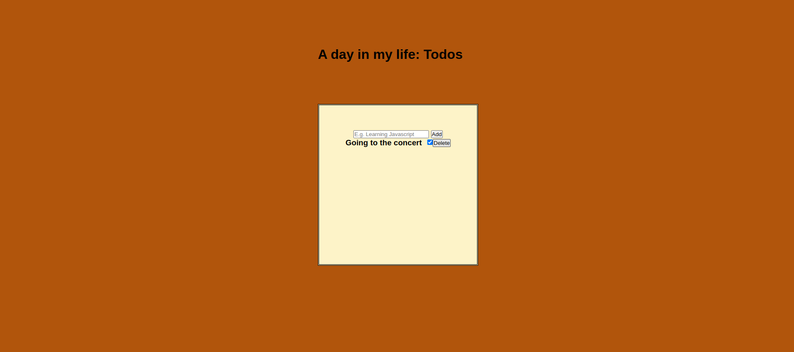

# Todos Api

> A simple Todos project, the project involves fetching data from an API and rendering it into the DOM

## Table of contents

- [Todos Api](#todos-api)
  - [Table of contents](#table-of-contents)
  - [General info](#general-info)
  - [Screenshots](#screenshots)
  - [Technologies](#technologies)
  - [Setup](#setup)
  - [Code Examples](#code-examples)
  - [Features](#features)
  - [Status](#status)
  - [Contact](#contact)

## General info

> The objective of the project is to practice separation of concern in
> JavaScript, fetch data from an API and render it into the DOM using /api-calls, /handlers and async/await syntax.

## Screenshots



## Technologies

- JavaScript
- HTML5
- CSS3
- VSC code

## Setup

clone the repo and start using the stop watch.

## Code Examples

```js
const createTodo = (todoData) => {
    //container
    const container = document.createElement('div');
    container.classList.add('todo');
    container.id = todoData.id;
    };
```

## Features

List of features ready and Todos for future development

Add Todo:

Allows users to create and add new todo items to the list.
The user can input the title of the todo and submit it to be added to the list.

View Todos:

Fetches and displays a list of todo items from an external API.
The todos are displayed in a list format on the web page.

Delete Todo:

Allows users to delete a todo item from the list.
The todo item is removed both from the UI and the external data source.

Error Handling:

Handles errors gracefully when interacting with the API.
Provides user feedback if there are issues with network requests or other operations.

## Status

Project is: _Completed_


## Contact
[Richelle Pintucan](https://github.com/richellepintucan)
